# Cua - Computer Use Agent Framework

> **项目摘要**: Cua 是一个构建、基准测试和部署计算机使用代理的统一框架，提供跨平台的沙箱环境、多模型代理支持和背景自动化能力。

> **最后更新**: 2026-05-01 | **文档版本**: 1.0.0 | **架构状态**: 活跃开发中

---

## 变更记录 (Changelog)

### 2026-05-01
- 初始化 AI 上下文文档
- 完成项目架构分析
- 生成模块索引和覆盖率报告

---

## 项目愿景

Cua 旨在成为**计算机使用代理（Computer Use Agents）的基础设施层**，提供：

1. **统一抽象**: 一套 API 控制任何操作系统（Linux、macOS、Windows、Android）
2. **多云支持**: 无缝切换本地 QEMU、Docker、云端沙箱
3. **多模型兼容**: 支持 Anthropic Claude、OpenAI、Gemini、Qwen 等主流 VLM
4. **可观测性**: 内置遥测、轨迹录制、基准测试框架
5. **背景自动化**: macOS 驱动支持不抢占焦点的后台操作

---

## 架构总览

### 技术栈分布

| 语言/技术 | 占比 | 主要用途 |
|----------|------|---------|
| **Python** | 55% | 核心SDK、代理框架、MCP服务器 |
| **TypeScript** | 25% | CLI工具、计算机SDK、Web界面 |
| **Swift** | 10% | Lume虚拟化框架、CUA Driver |
| **Shell/配置** | 10% | CI/CD、容器构建、自动化脚本 |

### 核心设计原则

1. **分层解耦**: Runtime → Interface → Agent 三层架构
2. **运行时多态**: 同一 `Sandbox` API 支持多种后端
3. **懒加载优化**: 核心模块使用懒导入减少启动开销
4. **遥测内置**: PostHog + OpenTelemetry 双轨监控

---

## 模块结构图

```mermaid
graph TD
    A["Cua Monorepo"] --> B["Python SDK (libs/python/)"]
    A --> C["TypeScript SDK (libs/typescript/)"]
    A --> D["Native Tools (libs/ *)"]
    A --> E["Infrastructure (docs/, .github/)"]

    B --> B1["cua-core - 遥测与工具"]
    B --> B2["cua-computer - CUI框架"]
    B --> B3["cua-agent - 多模型代理"]
    B --> B4["cua-sandbox - 沙箱运行时"]
    B --> B5["cua-mcp-server - MCP集成"]
    B --> B6["cua-cli - 命令行工具"]

    C --> C1["@trycua/core - TS核心库"]
    C --> C2["@trycua/computer - 计算机SDK"]
    C --> C3["@trycua/agent - 代理SDK"]
    C --> C4["cua-cli - TypeScript CLI"]

    D --> D1["cua-driver - macOS后台驱动"]
    D --> D2["lume - macOS虚拟化CLI"]
    D --> D3["cua-bench - 基准测试框架"]
    D --> D4["cuabot - 多代理沙箱CLI"]

    E --> E1["文档站点 (Docusaurus)"]
    E --> E2["CI/CD工作流"]
    E --> E3["容器构建配置"]

    click B1 "./libs/python/core/CLAUDE.md" "查看 cua-core 模块"
    click B2 "./libs/python/computer/CLAUDE.md" "查看 cua-computer 模块"
    click B3 "./libs/python/agent/CLAUDE.md" "查看 cua-agent 模块"
    click B4 "./libs/python/cua-sandbox/CLAUDE.md" "查看 cua-sandbox 模块"
    click D1 "./libs/cua-driver/CLAUDE.md" "查看 cua-driver 模块"
    click D3 "./libs/cua-bench/CLAUDE.md" "查看 cua-bench 模块"
```



---

## 模块索引

### Python 核心模块

| 模块路径 | 职责 | 入口文件 | 测试覆盖 |
|---------|------|---------|---------|
| **cua-core** | 遥测、日志、共享工具 | `cua_core/__init__.py` | ✅ 完整 |
| **cua-computer** | 跨平台计算机控制接口 | `computer/__init__.py` | ✅ 完整 |
| **cua-agent** | 多模型计算机使用代理 | `cua_agent/__init__.py` | ✅ 完整 |
| **cua-sandbox** | 沙箱运行时管理 | `cua_sandbox/__init__.py` | ✅ 完整 |
| **cua-mcp-server** | Model Context Protocol 服务器 | `mcp_server/__init__.py` | ⚠️ 部分 |
| **cua-cli** | 统一命令行工具 | `cua_cli/__init__.py` | ⚠️ 部分 |
| **cua-som** | Set-of-Mark 视觉解析器 | `som/__init__.py` | ❌ 缺失 |
| **cua-auto** | 本地自动化工具 | `cua_auto/__init__.py` | ❌ 缺失 |

### TypeScript 模块

| 模块路径 | 职责 | 包名 | 状态 |
|---------|------|------|------|
| **@trycua/core** | TypeScript 核心库 | `@trycua/core` | ✅ 稳定 |
| **@trycua/computer** | 计算机交互 SDK | `@trycua/computer` | ✅ 稳定 |
| **@trycua/agent** | 代理 SDK | `@trycua/agent` | 🔨 开发中 |
| **cua-cli** | TypeScript CLI | `cua-cli` | 🔨 开发中 |

### 原生工具模块

| 模块路径 | 职责 | 语言 | 状态 |
|---------|------|------|------|
| **cua-driver** | macOS 后台计算机使用驱动 | Swift | ✅ 生产就绪 |
| **lume** | Apple Virtualization Framework CLI | Swift | ✅ 稳定 |
| **cua-bench** | 跨平台基准测试框架 | Python | ✅ 活跃开发 |
| **cuabot** | 多代理协作 CLI | TypeScript/Python | 🔨 实验性 |

### 基础设施模块

| 模块路径 | 职责 | 技术栈 |
|---------|------|--------|
| **docs/** | Docusaurus 文档站点 | MDX + TypeScript |
| **.github/workflows/** | CI/CD 管道 | GitHub Actions |
| **libs/qemu-docker/** | QEMU 容器化运行时 | Docker + Shell |

---

## 运行与开发

### 快速开始

```bash
# 1. 安装 Lume CLI（macOS 本地虚拟化）
/bin/bash -c "$(curl -fsSL https://raw.githubusercontent.com/trycua/cua/main/libs/lume/scripts/install.sh)"

# 2. 克隆仓库
git clone https://github.com/trycua/cua.git
cd cua

# 3. 配置环境变量
cat > .env.local << EOF
ANTHROPIC_API_KEY=sk-ant-xxx
OPENAI_API_KEY=sk-xxx
CUA_API_KEY=cua-xxx
EOF

# 4. 安装依赖
pnpm install    # Node.js 依赖
uv sync         # Python 依赖（需先 `pip install uv`）

# 5. 安装 pre-commit 钩子
uv run pre-commit install
```

### 开发工作流

#### Python 开发

```bash
# 激活虚拟环境
source .venv/bin/activate

# 运行测试（所有包）
pytest libs/python/*/tests/ -v

# 运行特定包测试
cd libs/python/agent && pytest tests/ -v

# 代码检查
uv run ruff check libs/python/
uv run mypy libs/python/

# 构建并安装本地包
uv build
uv pip install -e libs/python/cua
```

#### TypeScript 开发

```bash
# 构建所有包
pnpm build:all

# 运行测试
pnpm test:all

# 类型检查
pnpm --filter @trycua/computer typecheck

# 发布到 npm
pnpm -r publish
```

#### Swift 开发（Lume/Driver）

```bash
cd libs/lume  # 或 libs/cua-driver

# 构建并安装
swift build
swift install

# 运行测试
swift test
```

### 工作区配置

项目使用 VS Code 工作区进行多语言开发：

```bash
# Python 开发
code .vscode/py.code-workspace

# Lume（Swift）开发
code .vscode/lume.code-workspace
```

---

## 测试策略

### 测试架构原则

1. **SRP（单一职责）**: 每个测试文件对应一个功能点
2. **垂直切片**: 集成测试覆盖完整用户旅程
3. **可测试性**: 使用依赖注入和模拟隔离外部依赖

### 测试覆盖率

| 模块 | 单元测试 | 集成测试 | E2E 测试 | 覆盖率 |
|------|---------|---------|---------|--------|
| cua-core | ✅ | ✅ | ❌ | 85%+ |
| cua-computer | ✅ | ✅ | ✅ | 75%+ |
| cua-agent | ✅ | ⚠️ | ⚠️ | 60%+ |
| cua-sandbox | ✅ | ✅ | ✅ | 70%+ |
| cua-bench | ✅ | ✅ | ✅ | 80%+ |
| TypeScript 包 | ✅ | ⚠️ | ❌ | 50%+ |

### 运行测试

```bash
# Python 测试
export CUA_TELEMETRY_ENABLED=false
pytest libs/python/*/tests/ -v --cov=libs/python --cov-report=html

# TypeScript 测试
pnpm test:all

# 特定测试场景
pytest libs/python/computer/tests/test_computer.py::TestComputerContextManager -v
```

---

## 编码规范

### Python 规范

- **格式化**: Black (line-length=100)
- **Linting**: Ruff (E, F, B, I 规则)
- **类型检查**: mypy (strict mode)
- **导入排序**: isort (profile=black)
- **文档**: Google-style docstrings

### TypeScript 规范

- **格式化**: Prettier
- **Linting**: ESLint + TypeScript
- **包管理**: pnpm (workspace)
- **构建**: tsdown

### Swift 规范

- **格式化**: Swift Format
- **Linting**: SwiftLint
- **包管理**: Swift Package Manager

### Git 规范

- **提交信息**: Conventional Commits
- **分支模型**: main（稳定）+ feature/*（开发）
- **Pre-commit 钩子**: 自动运行格式化和测试

---

## AI 使用指引

### 适合 AI 辅助的任务

#### ✅ 推荐场景

1. **代码生成**: 基于 CUI 接口生成新的沙箱集成
2. **测试编写**: 为新功能生成单元测试和集成测试
3. **文档更新**: 同步 API 变更到文档站点
4. **Bug 修复**: 分析错误日志并定位问题
5. **重构建议**: 识别代码异味并提供改进方案

#### ⚠️ 需要人工监督

1. **多语言互操作**: Python ↔️ TypeScript ↔️ Swift 的 FFI 边界
2. **性能优化**: 遥测开销、懒加载策略
3. **安全审查**: MCP 服务器权限、沙箱隔离
4. **架构决策**: 新运行时支持、破坏性 API 变更

### AI 辅助工作流示例

#### 场景 1: 添加新的沙箱运行时

```python
# 1. AI 生成接口实现
# 2. 人工审查资源管理和错误处理
# 3. AI 生成单元测试
# 4. 人工验证集成测试
# 5. AI 更新文档
```

#### 场景 2: 调试代理行为

```bash
# 1. 启用详细日志
export CUA_TELEMETRY_ENABLED=false
export DEBUG=*

# 2. 运行并捕获轨迹
cua run "任务描述" --trace output.json

# 3. AI 分析轨迹文件
# 4. AI 建议修复方案
# 5. 人工验证并应用
```

### 关键上下文文件

为 AI 提供这些文件以获得更好的辅助：

- **架构理解**: `CLAUDE.md`（本文档）、`Development.md`
- **API 参考**: `libs/python/*/README.md`
- **测试示例**: `libs/*/tests/test_*.py`
- **类型定义**: `libs/python/computer/computer/models.py`
- **变更历史**: `CHANGELOG.md`、`changelog/` 目录

---

## 常见问题 (FAQ)

### Q1: 如何在本地运行完整的沙箱？

```bash
# 使用 QEMU 本地运行 Linux
cua sandbox create --image linux --runtime qemu
cua shell  # 进入沙箱

# 使用 Lume 运行 macOS
lume create --image sequoia
lume shell
```

### Q2: 如何添加新的 VLM 模型支持？

1. 在 `cua_agent/loops/` 下创建新的配置类
2. 实现 `AsyncAgentConfig` 协议
3. 在 `__init__.py` 中注册循环
4. 添加文档和示例

### Q3: TypeScript 和 Python SDK 如何选择？

- **Python SDK**: 生产环境、完整功能、所有运行时
- **TypeScript SDK**: Node.js 生态、边缘计算、Web 集成

### Q4: 如何禁用遥测？

```bash
# 环境变量
export CUA_TELEMETRY_ENABLED=false

# 代码中
from cua import Sandbox
async with Sandbox.ephemeral(Image.linux(), telemetry_enabled=False) as sb:
    ...
```

### Q5: CI/CD 管道如何工作？

- **触发**: Push 到 `main`、PR 创建、标签推送
- **阶段**: lint → test → build → publish
- **部署**: PyPI、npm、Homebrew、Docker Hub

---

## 相关链接

- **官方文档**: https://cua.ai/docs
- **GitHub 仓库**: https://github.com/trycua/cua
- **Discord 社区**: https://discord.gg/mVnXXpdE85
- **Twitter/X**: https://x.com/trycua
- **博客**: https://cua.ai/blog

---

*此文档由 AI 自动生成并持续维护。如有疑问或建议，请提交 Issue 或 PR。*
